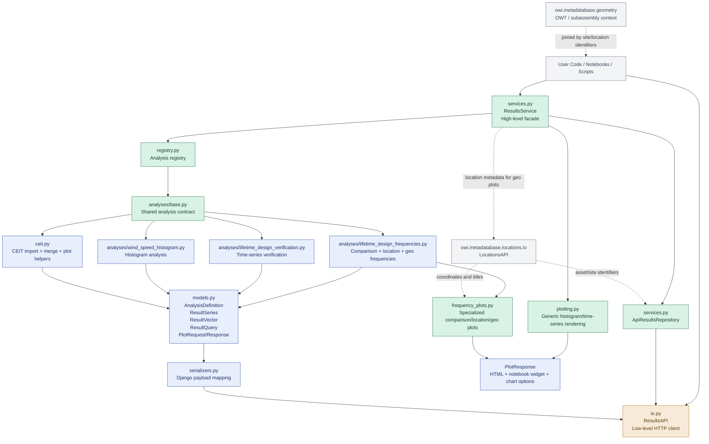
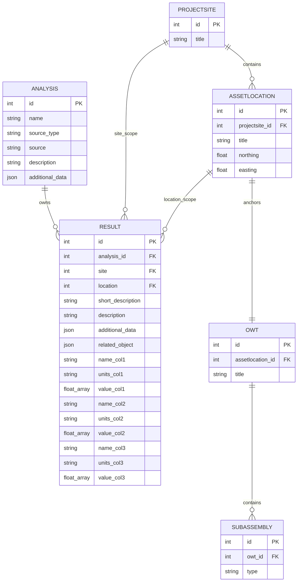

# OWI-metadatabase Results Extension

Results extension for OWI Metadatabase SDK

[](https://pypi.org/project/owi-metadatabase-results/)
[](https://pypi.org/project/owi-metadatabase-results/)
[](https://github.com/OWI-Lab/owi-metadatabase-results-sdk/blob/main/LICENSE)
[](https://github.com/OWI-Lab/owi-metadatabase-results-sdk/actions/workflows/ci.yml)
[](https://github.com/OWI-Lab/owi-metadatabase-results-sdk/actions/workflows/ci.yml)
[](https://github.com/OWI-Lab/owi-metadatabase-results-sdk/issues)
[](https://owi-lab.github.io/owi-metadatabase-results-sdk/)

## Overview

This package extends [`owi-metadatabase`](https://pypi.org/project/owi-metadatabase/) SDK under the `owi.metadatabase.*` namespace so it behaves like the existing extension packages.

📚 **[Read the Documentation](https://owi-lab.github.io/owi-metadatabase-results-sdk/)**

## Installation

### Install as extension package (`owi-metadatabase-results`)

```bash
pip install owi-metadatabase-results
```

Using `uv`:

```bash
uv pip install owi-metadatabase-results
```

### Install from core package extra (`owi-metadatabase[results]`)

If you prefer installing from the base package extras:

```bash
pip install "owi-metadatabase[results]"
```

Using `uv`:

```bash
uv pip install "owi-metadatabase[results]"
```

## Quick Start

```python
from owi.metadatabase.results import ResultsAPI

api = ResultsAPI(token="your-api-token")
print(api.ping())
```

## Architecture At A Glance

The diagram below shows how the package is structured, which parts are core, and how data moves from domain payloads to backend persistence and plots.



## Data Model At A Glance

The results extension stores analysis metadata separately from persisted result rows. Result rows link back to site and location metadata, while geometry stays adjacent and is usually joined through location-aware identifiers.



Interpretation:

- `ANALYSIS` stores one logical analysis definition, such as `LifetimeDesignVerification` or `WindSpeedHistogram`.
- `RESULT` stores one persisted series row with 2 to 3 aligned numeric vectors plus JSON metadata.
- `PROJECTSITE` and `ASSETLOCATION` come from the locations package and provide the site and asset identifiers used by result queries.
- `northing` and `easting` on `ASSETLOCATION` are what make geo-oriented result plots possible.
- Geometry objects like `OWT` and `SUBASSEMBLY` are not owned by the results package, but they are the physical context users typically join onto result rows through location/site relationships.

## Development

```bash
uv sync --dev
uv run invoke test
uv run invoke qa
uv run invoke docs.build
```
