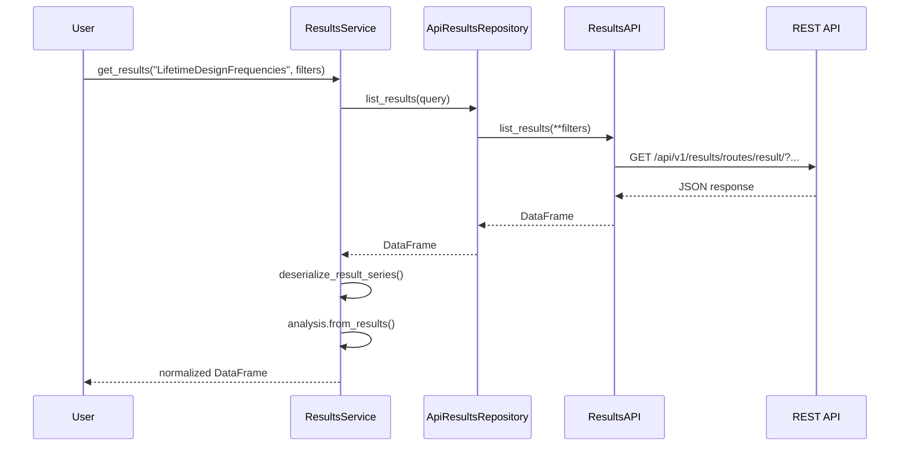

# Architecture

The Results SDK is a layered system with clear separation of concerns. This
page explains each layer, the design patterns in use, and how a typical
request flows from user code to the backend and back.

## Package Structure

```txt
owi.metadatabase.results
├── io.py              # ResultsAPI — HTTP client layer
├── models.py          # Pydantic data models
├── endpoints.py       # Route definitions
├── protocols.py       # Runtime-checkable protocol contracts
├── registry.py        # Analysis registration
├── serializers.py     # Django ↔ SDK translation
├── utils.py           # Helpers (token loading, logging)
├── analyses/          # Concrete analysis implementations
│   ├── base.py        # BaseAnalysis mixin (template method)
│   ├── lifetime_design_frequencies.py
│   ├── lifetime_design_verification.py
│   ├── wind_speed_histogram.py
│   └── ceit.py        # CEIT sensor data handling
├── plotting/          # Visualization layer
│   ├── strategies.py  # PlotStrategyProtocol implementations
│   ├── theme.py       # Chart styling
│   ├── frequency.py   # Frequency-specific plotters
│   ├── ceit.py        # CEIT-specific plotters
│   └── response.py    # Response builders (notebook, HTML, JSON)
└── services/          # High-level service facade
    ├── core.py        # ResultsService + ApiResultsRepository
    └── ceit.py        # CeitResultsService
```

## Design Patterns

### Registry Pattern

Concrete analyses register themselves with `@register_analysis`. The
`AnalysisRegistry` holds a name → class mapping used by `ResultsService`
for dispatch:

```python
from owi.metadatabase.results.registry import register_analysis

@register_analysis
class LifetimeDesignFrequencies(BaseAnalysis):
    analysis_name = "LifetimeDesignFrequencies"
    ...
```

### Template Method

`BaseAnalysis` defines a skeleton workflow with default implementations:
`validate_inputs()` → `compute()` → `to_results()` → `from_results()` →
`plot()`. Concrete analyses override specific steps.

### Strategy Pattern

Plot rendering is delegated to `PlotStrategyProtocol` implementations
(e.g. `HistogramPlotStrategy`, `TimeSeriesPlotStrategy`). The analysis
chooses a strategy by name, and `get_plot_strategy()` resolves it.

### Adapter Pattern

`ApiResultsRepository` wraps `ResultsAPI` to satisfy
`ResultsRepositoryProtocol`, decoupling the service layer from HTTP
transport.

### Facade Pattern

`ResultsService` provides a single entry point combining the repository,
registry, and serialization logic. Users call `get_results()` or
`plot_results()` without managing the underlying components.

### Protocol-driven Contracts

The SDK defines runtime-checkable protocols (`ResultProtocol`,
`PlotStrategyProtocol`, `AnalysisProtocol`, `ResultsRepositoryProtocol`,
`QueryServiceProtocol`) to enforce structural typing without requiring
inheritance.

## Request Lifecycle



## Data Flow Summary

1. **User** calls `ResultsService.get_results()` with an analysis name and
   filters.
2. **Service** looks up the analysis class in the registry.
3. **Repository** translates the query into HTTP parameters.
4. **API** sends an authenticated GET request and converts the JSON
   response to a DataFrame.
5. **Service** deserializes the raw rows into typed `ResultSeries` objects.
6. **Analysis** reconstructs the normalized computation frame from the
   result series.
7. **User** receives a clean pandas DataFrame.

## Return Value Conventions

All API methods return a dict with consistent keys:

| Key | Type | Description |
|-----|------|-------------|
| `data` | `DataFrame` | Tabular result data. |
| `exists` | `bool` | `True` when at least one row was returned. |
| `id` | `int` (optional) | The primary key of a created or fetched row. |
