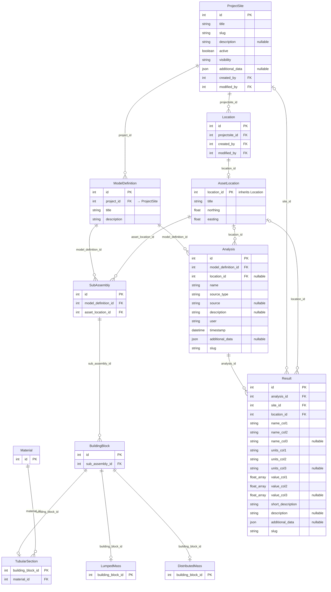
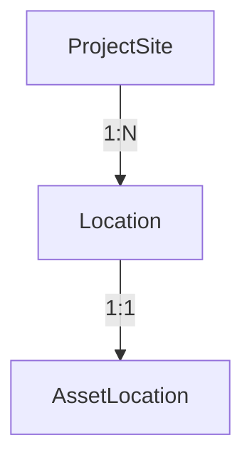
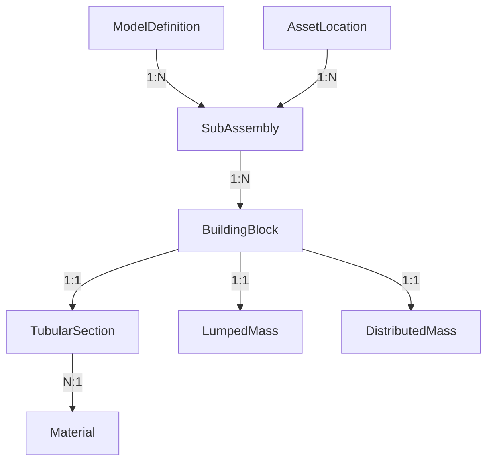
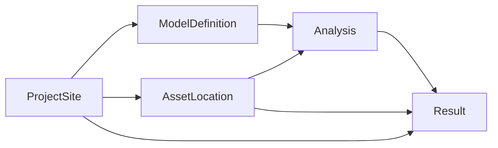

# Data Model

The OWI Metadatabase organises offshore wind data across three Django apps:
**locations**, **geometry**, and **results**. This page explains how those
models relate to each other using the exact schema defined in the backend.

## Full Entity Relationship Diagram

## Locations Domain

### ProjectSite

The top-level container. Each offshore wind farm is a `ProjectSite` with a
unique `slug`.

**Real example:** `id=31`, `slug="nobelwind"`, `title="Nobelwind"`.

### Location

A generic spatial record linked to a `ProjectSite` via `projectsite_id`.

### AssetLocation

Extends `Location` through **multi-table inheritance** — the
`location_id` column is both the primary key and a one-to-one FK back to
`Location`. Carries asset-specific attributes like `title`, `northing`,
and `easting`.

## Geometry Domain

### ModelDefinition

A geometry model version (e.g. "as-built Belwind"). FK `project` points
to `ProjectSite`.

**Real example:** `id=12`, `title="as-built Belwind"`, `project=35`.

### SubAssembly

Links a `ModelDefinition` to an `AssetLocation`, representing a specific
turbine structure instance.

### BuildingBlock

A structural element belonging to a `SubAssembly`. Each building block
may specialise into exactly one of:

- **TubularSection** — cylindrical shell with a `Material` FK.
- **LumpedMass** — point mass.
- **DistributedMass** — distributed mass.

## Results Domain

### Analysis

A named collection of results tied to a `ModelDefinition` and optionally
scoped to a specific `AssetLocation`.

**Real example:** `id=5`, `name="Belwind_weld_inspection"`,
`model_definition=12`, `source_type="json"`.

### Result

Stores typed, multi-column array data. Each row brings:

- Up to **three named columns** (`name_col1`/`name_col2`/`name_col3`)
  with corresponding **units** and **value arrays** (`ArrayField(float)`).
- A `short_description` serving as a stable merge key.
- An `additional_data` `JSONField` for structured metadata
  (e.g. `result_scope`, `analysis_kind`, `reference_labels`).

**Real example:** `id=3372`, `analysis=46`, `site=35`, `location=435`,
`name_col1="reference_index"`, `name_col2="FA1"`,
`value_col1=[0.0, 1.0, 2.0]`, `value_col2=[0.3406, 0.333, 0.3254]`.

### Cross-Domain Relationships

Results connect the locations, geometry, and analysis domains.
`Result.site` points to `ProjectSite`, `Result.location` points to
`AssetLocation`, and `Result.analysis` links back through
`Analysis.model_definition` to the geometry tree.
