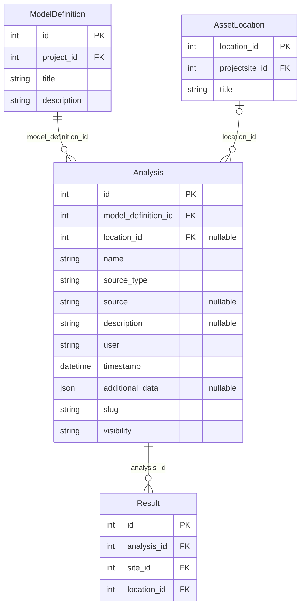
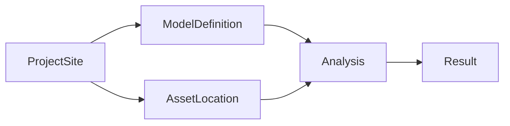

# Analysis QuerySet Examples

These examples demonstrate how to query and traverse the backend `Analysis`
model using the Django QuerySet API. All field names, relationships, and
constraints reflect the exact schema enforced by the OWI Metadatabase.

## Shell Setup

```python
from results.models import Analysis
```

---

## Data Model Overview

`Analysis` is a persisted backend row representing a named collection of
results attached to a specific model definition.

**Key fields:**

| Field | Type | Description |
|-------|------|-------------|
| `id` | `int` (PK) | Auto-generated primary key. |
| `name` | `str` | Human-readable analysis name. |
| `model_definition_id` | `int` (FK → `ModelDefinition`) | Links to geometry model. |
| `location_id` | `int` (FK → `AssetLocation`, nullable) | Optional location scope. |
| `source_type` | `str` | Source format identifier (e.g. `"json"`, `"notebook"`). |
| `source` | `file` (nullable) | Source file or URL. |
| `description` | `str` (nullable) | Free-text description. |
| `user` | `str` | Creator identifier. |
| `timestamp` | `datetime` | Creation timestamp. |
| `additional_data` | `json` (nullable) | Arbitrary metadata. |
| `visibility` | `str` | Visibility level. |
| `visibility_groups` | `list[int]` | Group-based access control. |
| `slug` | `str` | URL-safe unique identifier. |

**Relationships:**

- `Analysis.model_definition` → `ModelDefinition` (many-to-one)
- `Analysis.location` → `AssetLocation` (many-to-one, nullable)
- `Analysis.result_set` → `Result` (one-to-many, reverse relation)

---

## Entity Relationship Diagram



---

## Query Flow



---

## Basic Queries

```python
# Retrieve all analyses.
Analysis.objects.all()

# Filter by exact name — matches the real record "Belwind_weld_inspection".
Analysis.objects.filter(name="Belwind_weld_inspection")

# Filter by primary key.
Analysis.objects.get(pk=5)

# Filter by model definition foreign key.
Analysis.objects.filter(model_definition_id=12)

# Filter by source type.
Analysis.objects.filter(source_type="json")
```

---

## Filtering with Lookups

```python
# Case-insensitive partial match on description.
Analysis.objects.filter(description__icontains="weld inspection")

# Analyses created after a specific date.
from datetime import datetime, timezone
Analysis.objects.filter(
    timestamp__gte=datetime(2025, 1, 1, tzinfo=timezone.utc)
)

# Analyses with non-null location scope.
Analysis.objects.filter(location__isnull=False)

# Analyses without any location constraint.
Analysis.objects.filter(location__isnull=True)
```

---

## Related Fetching with `select_related`

```python
# Fetch analyses with their model definition and location in a single query.
# This avoids N+1 queries when iterating over results.
analyses = Analysis.objects.select_related(
    "model_definition", "location"
)

for a in analyses:
    print(a.name, a.model_definition.title, a.location)
```

---

## Reverse Relations

```python
# From a ModelDefinition, get all linked analyses.
from geometry.models import ModelDefinition

model_def = ModelDefinition.objects.get(pk=12)
model_def.analysis_set.all()

# From a location, get all analyses scoped to it.
analysis = Analysis.objects.select_related("location").get(pk=5)
if analysis.location_id is not None:
    analysis.location.analysis_set.all()
```

---

## Deep Joins Across Relations

```python
# Analyses whose model definition belongs to the Nobelwind project site.
Analysis.objects.filter(
    model_definition__project__projectsite__slug="nobelwind"
)

# Combine cross-relation filters with local field filters.
Analysis.objects.filter(
    model_definition__project__projectsite__slug="nobelwind",
    source_type="json",
)

# Analyses whose optional location belongs to a specific project site.
Analysis.objects.filter(
    location__projectsite__slug="nobelwind"
)
```

---

## Prefetching for Batch Access

```python
# When you need to access each analysis's results without N+1 queries:
analyses = Analysis.objects.prefetch_related("result_set").filter(
    model_definition_id=12
)

for a in analyses:
    print(a.name, "→", a.result_set.count(), "results")
```

---

## Aggregations

```python
from django.db.models import Count, Max

# Count results per analysis.
Analysis.objects.annotate(
    result_count=Count("result")
).values("name", "result_count")

# Most recent analysis per model definition.
Analysis.objects.values("model_definition_id").annotate(
    latest=Max("timestamp")
)
```

---

## SDK Alignment

The Results SDK exposes the same persisted shape through `ResultsAPI`.

### List Analyses

```python
from owi.metadatabase.results import ResultsAPI

api = ResultsAPI(token="your-api-token")

# List all analyses (maps to Analysis.objects.all() on the backend).
api.list_analyses()

# Filter by name.
api.list_analyses(name="Belwind_weld_inspection")

# Filter by model definition through nested lookup.
api.list_analyses(model_definition__id=12)

# Filter by project title.
api.list_analyses(project__title="Belwind")
```

### Get a Single Analysis

```python
api.get_analysis(name="Belwind_weld_inspection")
```

### Create an Analysis

```python
api.create_analysis(
    {
        "name": "Belwind_weld_inspection",
        "model_definition_id": 12,
        "location_id": None,
        "source_type": "json",
        "source": "https://example.invalid/belwind-weld-inspection.json",
        "description": "Weld inspection data for Belwind turbines",
    }
)
```

---

## Live Route Validation

The live dev list route was validated with authenticated GET requests to
`/api/v1/results/routes/analysis/`.

**Confirmed working filters:**

| Filter | Example value |
|--------|---------------|
| `name` | `Belwind_weld_inspection` |
| `name__icontains` | `weld` |
| `source_type` | `json` |
| `model_definition__id` | `12` |
| `model_definition__title` | `as-built Belwind` |
| `project__title` | `Belwind` |
| `timestamp__gte` | `2025-01-01T00:00:00Z` |

!!! warning "Route vs. ORM"
    The public REST route exposes a stricter filter subset than the full
    Django QuerySet surface. Filters like `description__icontains` and
    direct `id` lookups are **not** supported on the live route. Use the
    confirmed filters above for SDK calls.
