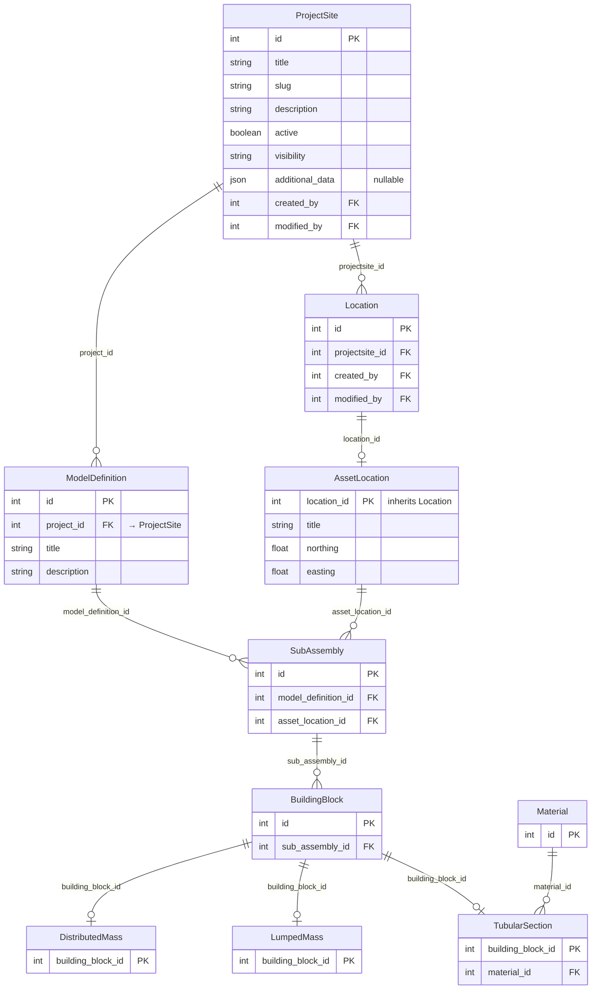
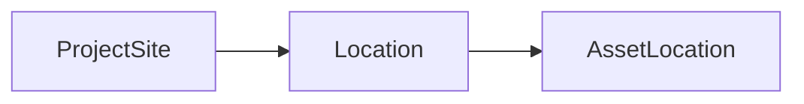
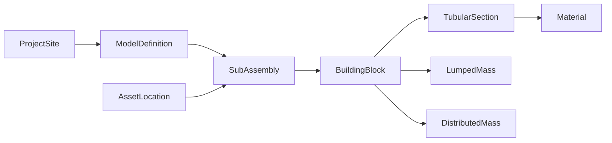

# Location & Geometry QuerySet Examples

These examples demonstrate how to query and traverse the `ProjectSite`,
`Location`, `AssetLocation`, `ModelDefinition`, `SubAssembly`,
`BuildingBlock`, and related geometry models. All field names and
relationships reflect the exact backend schema.

## Shell Setup

```python
from locations.models import AssetLocation, Location, ProjectSite
from geometry.models import (
    BuildingBlock,
    DistributedMass,
    LumpedMass,
    Material,
    ModelDefinition,
    SubAssembly,
    TubularSection,
)
```

---

## Data Model Overview

### Locations Hierarchy

- **`ProjectSite`** — top-level site containing multiple locations.
- **`Location`** — a named position within a site (FK → `ProjectSite`).
- **`AssetLocation`** — inherits from `Location` via a one-to-one link
  on `location_id` (multi-table inheritance).

### Geometry Hierarchy

- **`ModelDefinition`** — a geometry model version (FK → `ProjectSite` via `project`).
- **`SubAssembly`** — a structural component linked to a model definition
  and an asset location.
- **`BuildingBlock`** — an element of a sub-assembly.
- **`TubularSection`** — a building block specialization with a material FK.
- **`LumpedMass`** — a point mass building block.
- **`DistributedMass`** — a distributed mass building block.
- **`Material`** — standalone material properties.

---

## Entity Relationship Diagram



---

## Query Flow Diagrams

### Project Hierarchy



### Full Geometry Traversal



---

## ProjectSite Queries

```python
# Retrieve all project sites.
ProjectSite.objects.all()

# Filter by slug.
ProjectSite.objects.filter(slug="nobelwind")

# Filter by title (case-insensitive).
ProjectSite.objects.filter(title__icontains="nobelwind")

# Active sites only.
ProjectSite.objects.filter(active=True)

# Get a single site by slug.
site = ProjectSite.objects.get(slug="nobelwind")
```

### Real Data Example

```python
# The real Nobelwind record:
# id=31, slug="nobelwind", title="Nobelwind", active=False
site = ProjectSite.objects.get(slug="nobelwind")
print(site.title)       # "Nobelwind"
print(site.description) # "Nobelwind is the fourth project..."
```

---

## Location Queries

```python
# All locations for a project site.
Location.objects.filter(projectsite__slug="nobelwind")

# With the project site joined (avoids N+1).
Location.objects.select_related("projectsite").filter(
    projectsite__slug="nobelwind"
)
```

### Reverse Relations from ProjectSite

```python
site = ProjectSite.objects.get(slug="nobelwind")

# All locations belonging to this site (reverse FK).
site.location_set.all()

# Count locations.
site.location_set.count()
```

---

## AssetLocation Queries

`AssetLocation` inherits from `Location` through multi-table inheritance
(`location_id` is both the PK and the FK to `Location`).

```python
# All asset locations.
AssetLocation.objects.all()

# Asset locations for a specific project site (traverses through Location).
AssetLocation.objects.filter(projectsite__slug="nobelwind")

# With the parent location joined.
AssetLocation.objects.select_related("location_ptr")

# Access the parent Location fields directly.
asset = AssetLocation.objects.get(pk=435)
print(asset.title)      # e.g. "BBA01"
print(asset.northing)   # coordinate
print(asset.easting)    # coordinate
```

### Reverse Relations from ProjectSite

```python
site = ProjectSite.objects.get(slug="nobelwind")

# All asset locations for this site.
AssetLocation.objects.filter(projectsite=site)
```

---

## ModelDefinition Queries

```python
# All model definitions.
ModelDefinition.objects.all()

# Filter by project site.
ModelDefinition.objects.filter(project__slug="nobelwind")

# Filter by title.
ModelDefinition.objects.filter(title="as-built Belwind")

# Get a specific model definition.
model_def = ModelDefinition.objects.get(pk=12)
print(model_def.title)   # "as-built Belwind"
print(model_def.project)  # ProjectSite reference
```

### Reverse Relations

```python
site = ProjectSite.objects.get(slug="nobelwind")

# All model definitions for this site.
site.modeldefinition_set.all()
```

---

## SubAssembly Queries

```python
# All sub-assemblies for a model definition.
SubAssembly.objects.filter(model_definition_id=12)

# Sub-assemblies with their model definition and asset location joined.
SubAssembly.objects.select_related(
    "model_definition", "asset_location"
)

# Deep join: sub-assemblies for a project site.
SubAssembly.objects.filter(
    model_definition__project__slug="nobelwind"
)

# Sub-assemblies at a specific asset location.
SubAssembly.objects.filter(asset_location_id=435)
```

### Reverse Relations

```python
model_def = ModelDefinition.objects.get(pk=12)

# All sub-assemblies in this model definition.
model_def.subassembly_set.all()

# From an asset location.
asset = AssetLocation.objects.get(pk=435)
asset.subassembly_set.all()
```

---

## BuildingBlock Queries

```python
# All building blocks for a sub-assembly.
BuildingBlock.objects.filter(sub_assembly_id=100)

# Deep join: building blocks for a project site.
BuildingBlock.objects.filter(
    sub_assembly__model_definition__project__slug="nobelwind"
)

# With the sub-assembly joined.
BuildingBlock.objects.select_related("sub_assembly")
```

---

## Full Traversal: ProjectSite → Materials

```python
# Traverse from project site through geometry down to materials.
# This demonstrates a deep join across the full hierarchy.
TubularSection.objects.filter(
    building_block__sub_assembly__model_definition__project__slug="nobelwind"
).select_related("material", "building_block__sub_assembly__model_definition")
```

### Reverse: From Material to ProjectSite

```python
material = Material.objects.get(pk=1)

# All tubular sections using this material.
material.tubularsection_set.all()

# Traverse up to project sites.
ProjectSite.objects.filter(
    modeldefinition__subassembly__buildingblock__tubularsection__material=material
).distinct()
```

---

## Prefetching for Efficient Batch Access

```python
# Efficiently load a project site with its full geometry tree.
sites = ProjectSite.objects.prefetch_related(
    "location_set__assetlocation__subassembly_set__buildingblock_set"
).filter(slug="nobelwind")

for site in sites:
    for location in site.location_set.all():
        if hasattr(location, "assetlocation"):
            for sa in location.assetlocation.subassembly_set.all():
                for bb in sa.buildingblock_set.all():
                    print(site.title, sa, bb)
```

```python
# Prefetch model definitions with their full sub-assembly chain.
model_defs = ModelDefinition.objects.prefetch_related(
    "subassembly_set__buildingblock_set__tubularsection__material"
).filter(project__slug="nobelwind")

for md in model_defs:
    for sa in md.subassembly_set.all():
        for bb in sa.buildingblock_set.all():
            if hasattr(bb, "tubularsection"):
                print(md.title, bb.tubularsection.material)
```

---

## SDK Alignment

The core `owi-metadatabase` SDK provides `LocationsAPI` and `GeometryAPI`
for HTTP access to these models.

### LocationsAPI

```python
from owi.metadatabase.locations.io import LocationsAPI

api = LocationsAPI(api_root="https://owimetadatabase-dev.azurewebsites.net/api/v1",
                   token="your-api-token")

# Fetch all project sites.
api.get_projectsites()

# Get details for a specific site.
api.get_projectsite_detail(projectsite="Nobelwind")

# Get all asset locations for a site.
api.get_assetlocations(projectsite="Nobelwind")
```

### GeometryAPI

```python
from owi.metadatabase.geometry.io import GeometryAPI

api = GeometryAPI(api_root="https://owimetadatabase-dev.azurewebsites.net/api/v1",
                  token="your-api-token")

# Get model definition id for a site.
api.get_modeldefinition_id(
    projectsite="Nobelwind",
    model_definition="as-built Nobelwind",
)

# Fetch sub-assemblies for a model definition.
api.get_subassemblies(model_definition_id=12)

# Fetch building blocks for a sub-assembly.
api.get_buildingblocks(sub_assembly_id=100)
```
