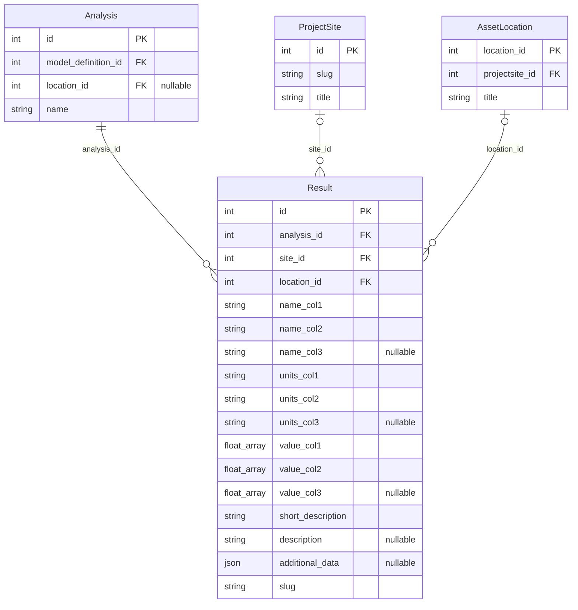
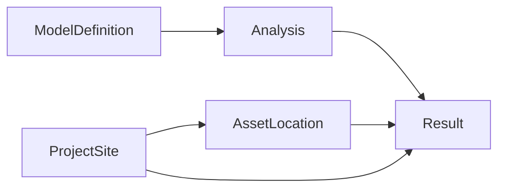

# Result QuerySet Examples

These examples demonstrate how to query and traverse the backend `Result`
model — including `ArrayField` and `JSONField` operations — using the Django
QuerySet API. All field names and relationships reflect the exact schema.

## Shell Setup

```python
from results.models import Analysis, Result
```

---

## Data Model Overview

`Result` is a persisted backend row that stores typed, multi-column
array data attached to an `Analysis`, a `ProjectSite` (via `site`), and
optionally an `AssetLocation` (via `location`).

**Key fields:**

| Field | Type | Description |
|-------|------|-------------|
| `id` | `int` (PK) | Auto-generated primary key. |
| `analysis_id` | `int` (FK → `Analysis`) | Parent analysis. |
| `site_id` | `int` (FK → `ProjectSite`) | Site scope. |
| `location_id` | `int` (FK → `AssetLocation`) | Location scope. |
| `name_col1` | `str` | Semantic name for column 1 (e.g. `"reference_index"`). |
| `name_col2` | `str` | Semantic name for column 2 (e.g. `"FA1"`). |
| `name_col3` | `str` (nullable) | Semantic name for column 3. |
| `units_col1` | `str` | Unit for column 1 (e.g. `"index"`). |
| `units_col2` | `str` | Unit for column 2 (e.g. `"Hz"`). |
| `units_col3` | `str` (nullable) | Unit for column 3. |
| `value_col1` | `ArrayField(float)` | Numeric array for column 1. |
| `value_col2` | `ArrayField(float)` | Numeric array for column 2. |
| `value_col3` | `ArrayField(float)` (nullable) | Numeric array for column 3. |
| `short_description` | `str` | Stable label (e.g. `"BBA01 - FA1"`). |
| `description` | `str` (nullable) | Free-text description. |
| `additional_data` | `json` (nullable) | Arbitrary structured metadata. |
| `slug` | `str` | URL-safe unique identifier. |
| `visibility` | `str` | Visibility level. |
| `visibility_groups` | `list[int]` | Group-based access control. |

**Relationships:**

- `Result.analysis` → `Analysis` (many-to-one)
- `Result.site` → `ProjectSite` (many-to-one)
- `Result.location` → `AssetLocation` (many-to-one)

---

## Entity Relationship Diagram



---

## Query Flow



---

## Basic Queries

```python
# Retrieve all result rows.
Result.objects.all()

# Filter by analysis foreign key.
Result.objects.filter(analysis_id=46)

# Filter by location foreign key.
Result.objects.filter(location_id=435)

# Filter by site foreign key.
Result.objects.filter(site_id=35)

# Filter by short description label.
Result.objects.filter(short_description="BBA01 - FA1")

# Filter by column name.
Result.objects.filter(name_col2="FA1")
```

---

## Related Fetching with `select_related`

```python
# Join analysis, site, and location in a single SQL query.
Result.objects.select_related("analysis", "site", "location")

# Load a result with its full analysis context.
result = Result.objects.select_related("analysis").get(pk=3372)
print(result.analysis.name)  # → "LifetimeDesignFrequencies" (or similar)
```

---

## Reverse Relations

```python
# From an Analysis, traverse to all attached results.
analysis = Analysis.objects.get(pk=46)
analysis.result_set.all()

# Count results per analysis.
analysis.result_set.count()

# Filter the reverse relation.
analysis.result_set.filter(name_col2="FA1")
```

---

## Deep Joins Across Relations

```python
# Results whose analysis is attached to model definition 12.
Result.objects.filter(analysis__model_definition_id=12)

# Results whose location belongs to the Nobelwind project site.
Result.objects.filter(location__projectsite__slug="nobelwind")

# Results whose analysis belongs to a specific project through model definition.
Result.objects.filter(
    analysis__model_definition__project__projectsite__slug="nobelwind"
)

# Combine cross-relation filters with local field constraints.
Result.objects.filter(
    analysis__model_definition_id=12,
    location__projectsite__slug="nobelwind",
    name_col2="FA1",
)
```

---

## Prefetching for Batch Access

```python
# Prefetch results when iterating over multiple analyses.
analyses = Analysis.objects.prefetch_related("result_set").filter(
    model_definition_id=12
)

for a in analyses:
    for r in a.result_set.all():
        print(a.name, r.short_description, len(r.value_col1))
```

---

## ArrayField Access and Interpretation

The `value_col1`, `value_col2`, and `value_col3` fields are PostgreSQL
`ArrayField(float)`. Each stores a vector of numeric values aligned by
index.

### Pair Arrays into a Series

```python
# Load a real result and pair the x/y arrays.
result = Result.objects.only(
    "name_col1", "name_col2",
    "value_col1", "value_col2",
    "additional_data",
).get(pk=3372)

# Zip the two columns into (x, y) pairs.
points = list(zip(result.value_col1, result.value_col2))
# → [(0.0, 0.3406), (1.0, 0.333), (2.0, 0.3254)]
```

### Reconstruct with JSON Metadata

```python
# The additional_data field carries reference labels that index into the arrays.
reference_labels = result.additional_data.get("reference_labels", [])

series = [
    {
        result.name_col1: x,        # "reference_index"
        "reference": label,          # "INFL", "ACTU", "FLEX"
        result.name_col2: y,         # "FA1"
    }
    for label, x, y in zip(
        reference_labels,
        result.value_col1,
        result.value_col2,
    )
]
```

### Filter by Array Position

```python
# Results whose first element in value_col1 is 0.0.
Result.objects.filter(value_col1__0=0.0)

# Results whose value_col2 contains the value 0.333.
Result.objects.filter(value_col2__contains=[0.333])
```

---

## JSONField Filters

The `additional_data` field is a Django `JSONField` that supports nested
key lookups.

```python
# Restrict to location-scoped comparison results.
Result.objects.filter(
    additional_data__result_scope="location",
    additional_data__analysis_kind="comparison",
)

# Filter by a specific turbine in metadata.
Result.objects.filter(additional_data__turbine="BBA01")

# Filter by a reference label present in a JSON array.
Result.objects.filter(
    additional_data__reference_labels__contains=["INFL"]
)
```

---

## Aggregations

```python
from django.db.models import Count

# Count results per analysis.
Result.objects.values("analysis__name").annotate(
    result_count=Count("id")
)

# Count results per location.
Result.objects.values("location__title").annotate(
    result_count=Count("id")
).order_by("-result_count")
```

---

## Optimized Queries

```python
# Use .only() to load just the columns you need.
Result.objects.only(
    "short_description", "value_col1", "value_col2"
).filter(analysis_id=46)

# Use .defer() to exclude heavy array columns when doing metadata scans.
Result.objects.defer(
    "value_col1", "value_col2", "value_col3"
).filter(analysis_id=46)

# Use .values_list() for flat extraction.
Result.objects.filter(analysis_id=46).values_list(
    "short_description", flat=True
)
```

---

## SDK Alignment

The Results SDK maps these ORM patterns to HTTP API calls:

### List Results

```python
from owi.metadatabase.results import ResultsAPI

api = ResultsAPI(token="your-api-token")

# Maps to Result.objects.filter(analysis__id=46)
api.list_results(analysis__id=46)

# Direct nested relation filters.
api.list_results(
    analysis__name="LifetimeDesignFrequencies",
    location__id=435,
    short_description="BBA01 - FA1",
)
```

### SDK Convenience Rewriting

The SDK rewrites common shortcuts to backend-compatible filters:

```python
# This shorthand:
api.list_results(analysis=46)

# Is rewritten internally to:
# api.list_results(analysis__id=46)
```

### Get a Raw Result Row

```python
api.get_results_raw(id=3372)
```

### Typed Deserialization Through ResultsService

```python
from owi.metadatabase.results.services import ResultsService
from owi.metadatabase.results.services import ApiResultsRepository
from owi.metadatabase.results.serializers import DjangoResultSerializer

service = ResultsService(repository=ApiResultsRepository(api=api))
serializer = DjangoResultSerializer()

# Retrieve, deserialize, and reconstruct the analysis frame.
frame = service.get_results(
    "LifetimeDesignFrequencies",
    filters={"analysis_id": 46},
)
print(frame.head())
```

---

## Live Route Validation

The live dev route was validated at `/api/v1/results/routes/result/`.

**Confirmed working filters:**

| Filter | Example value |
|--------|---------------|
| `analysis__id` | `46` |
| `analysis__name` | `LifetimeDesignFrequencies` |
| `location__id` | `435` |
| `location__title` | `BBA01` |
| `short_description` | `BBA01 - FA1` |
| `model_definition__id` | `12` |
| `project__title` | `Belwind` |
| `name_col1` | `reference_index` |
| `name_col2` | `FA1` |
| `timestamp__gte` | `2025-01-01T00:00:00Z` |

!!! warning "Route vs. ORM"
    The public REST route does **not** support `additional_data` key
    lookups or direct `id` filtering. The Django ORM examples above show
    the full backend surface; SDK calls should use the confirmed route
    filters listed in this table.
