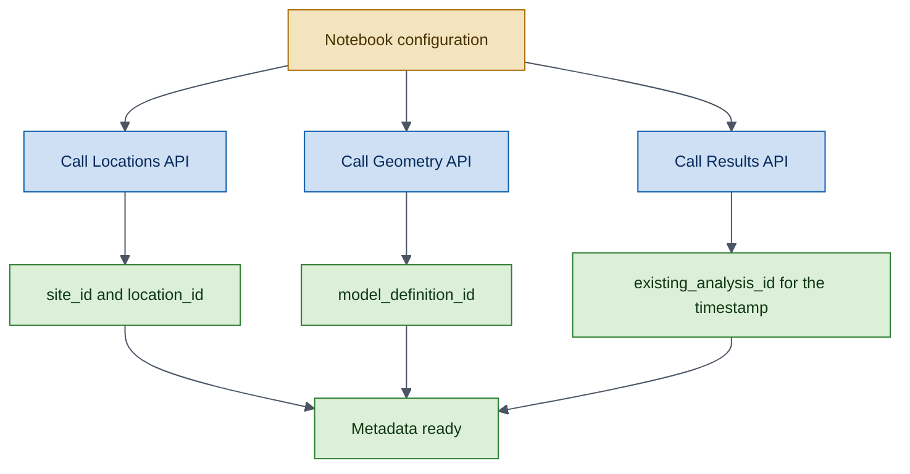
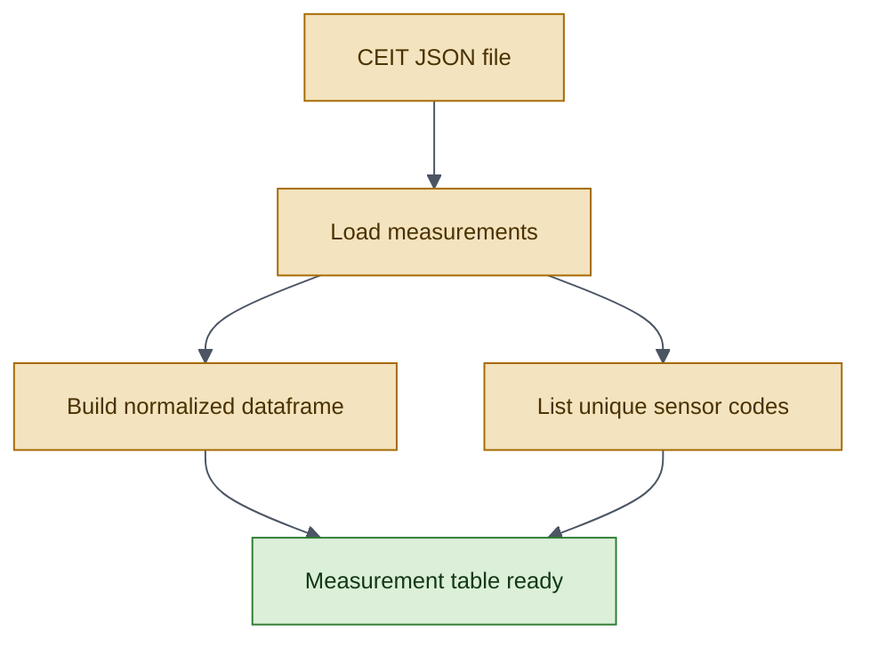
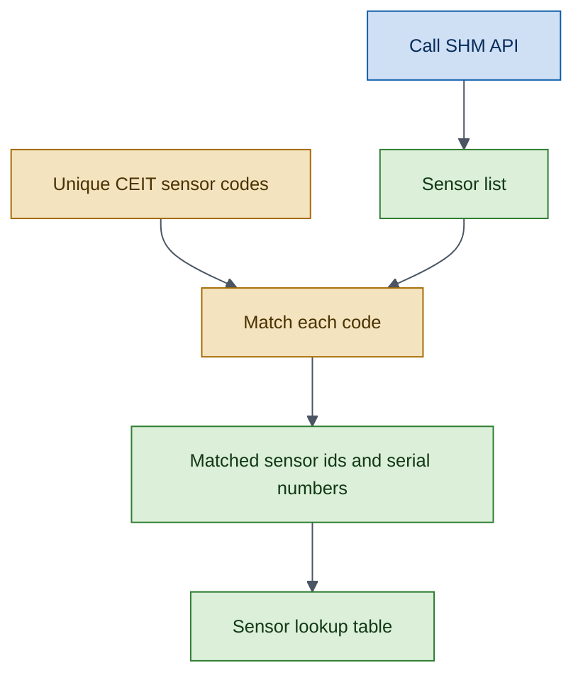
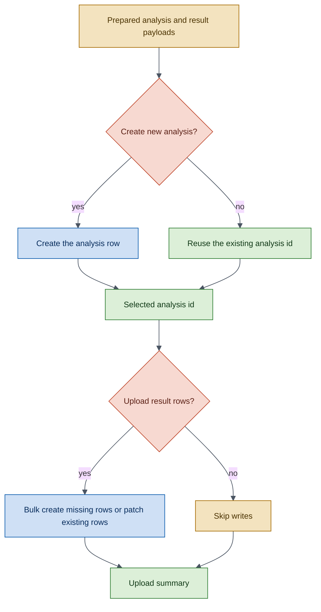
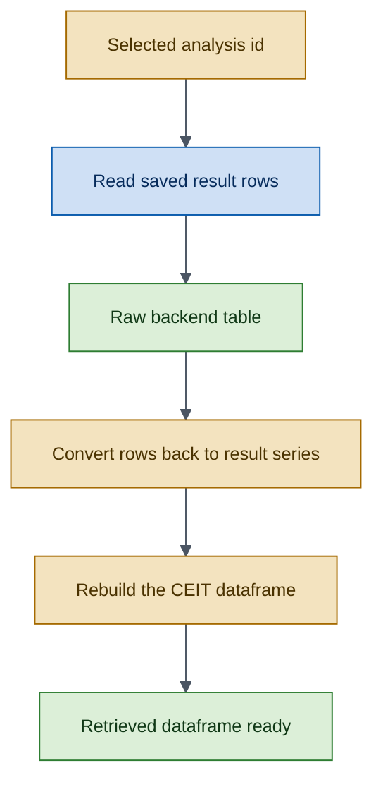
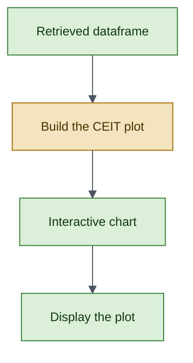

# CEIT Corrosion Monitoring Workflow

!!! example
    This tutorial walks through the complete `CorrosionMonitoring` (CEIT) lifecycle:
    load CEIT sensor measurements from a JSON file, match sensors to SHM records,
    upload results to the backend, retrieve them, and render interactive plots —
    all as explicit, auditable steps.

## Prerequisites

- Python 3.9+
- `owi-metadatabase-results`, `owi-metadatabase`, and `owi-metadatabase-shm`
  installed
- A valid API token stored in a `.env` file
- The CEIT measurement file at `scripts/data/MeasFile_24sea.json`

## Mermaid Color Legend

All workflow diagrams use the same color meaning.

- <span style="color:#0B5CAD;"><strong>Blue</strong></span>: API call.
- <span style="color:#2E7D32;"><strong>Green</strong></span>: data we keep or check.
- <span style="color:#A56A00;"><strong>Yellow</strong></span>: data we build or reshape.
- <span style="color:#C04A2F;"><strong>Red</strong></span>: choice or stop condition.
- <span style="color:#4B5563;"><strong>Grey line</strong></span>: step-to-step flow.

*Read each diagram from top to bottom.*

---

## Step 1 — Import the SDK Components

```python
import datetime
from pathlib import Path

import pandas as pd
from owi.metadatabase._utils.utils import load_token_from_env_file
from owi.metadatabase.geometry.io import GeometryAPI
from owi.metadatabase.locations.io import LocationsAPI
from owi.metadatabase.shm import ShmAPI

from owi.metadatabase.results import ResultsAPI
from owi.metadatabase.results.analyses.ceit import (
    CEIT_METRICS,
    CorrosionMonitoring,
    CorrosionMonitoringInput,
    ceit_frame_from_measurements,
    load_ceit_measurements,
)
from owi.metadatabase.results.models import AnalysisDefinition
from owi.metadatabase.results.plotting.ceit import plot_ceit_analyses
from owi.metadatabase.results.serializers import (
    DjangoAnalysisSerializer,
    DjangoResultSerializer,
)
```

---

## Step 2 — Configure Runtime Constants

```python
WORKSPACE_ROOT = Path.cwd().resolve().parent
DATA_FILE = WORKSPACE_ROOT / "scripts" / "data" / "MeasFile_24sea.json"
ENV_FILE = WORKSPACE_ROOT / ".env"
TOKEN_ENV_VAR = "OWI_METADATABASE_API_TOKEN"
BASE_URL = "https://owimetadatabase-dev.azurewebsites.net/api/v1"

PROJECTSITE = "Willow"
ASSETLOCATION = "CEIT"
MODEL_DEFINITION = "CEIT Willow"
ANALYSIS_NAME = "CeitCorrosionMonitoring-Test-Pietro"
TOKEN = load_token_from_env_file(ENV_FILE, TOKEN_ENV_VAR)
ANALYSIS_TIMESTAMP = datetime.datetime(2026, 3, 26, 0, 0, 0)

# Runtime controls.
CREATE_NEW_ANALYSIS = False
UPLOAD_RESULTS = True
```

---

## Step 3 — Resolve CEIT Metadata

Before loading measurements, resolve the backend identifiers for the
target project site, CEIT location, model definition, and any existing
analysis for the chosen timestamp.

**What is resolved**

- `site_id`
- `location_id`
- `model_definition_id`
- `existing_analysis_id` for the selected `ANALYSIS_TIMESTAMP`

*Outcome:* later cells can work with stable ids instead of repeating name-based lookups.



```python
locations_api = LocationsAPI(api_root=BASE_URL, token=TOKEN)
geometry_api = GeometryAPI(api_root=BASE_URL, token=TOKEN)
results_api = ResultsAPI(api_root=BASE_URL, token=TOKEN)
shm_api = ShmAPI(api_root=BASE_URL, token=TOKEN)
analysis = CorrosionMonitoring()
analysis_serializer = DjangoAnalysisSerializer()
result_serializer = DjangoResultSerializer()

# -- site_id
site_id = int(
    locations_api.get_projectsite_detail(projectsite=PROJECTSITE)["id"]
)

# -- location_id
willow_locations = locations_api.get_assetlocations(
    projectsite=PROJECTSITE
)["data"]
ceit_location = willow_locations.loc[
    willow_locations["title"].astype(str).str.casefold()
    == ASSETLOCATION.casefold()
].copy()
location_id = int(ceit_location.iloc[0]["id"])

# -- model_definition_id
model_definition_id = int(
    geometry_api.get_modeldefinition_id(
        projectsite=PROJECTSITE,
        model_definition=MODEL_DEFINITION,
    )["id"]
)

# -- existing_analysis_id
existing_analysis = results_api.get_analysis(
    name=ANALYSIS_NAME,
    model_definition__id=model_definition_id,
    timestamp=ANALYSIS_TIMESTAMP,
    location__id=location_id,
)
existing_analysis_id = (
    None
    if not existing_analysis["exists"] or existing_analysis["id"] is None
    else int(existing_analysis["id"])
)
```

---

## Step 4 — Load and Normalize the CEIT Measurements

This stage reads the CEIT JSON file and reshapes it into the flat table
used by the rest of the workflow.

**What happens here**

- Load the raw measurements from the JSON file.
- Expand them into one row per sensor, timestamp, and metric.
- List the unique sensor codes found in the file.

*Outcome:* the workflow has one normalized CEIT dataframe ready for matching, upload, retrieval, and plotting.



```python
measurements = load_ceit_measurements(DATA_FILE)
measurement_frame = ceit_frame_from_measurements(measurements)
unique_sensors = sorted(
    {m.sensor_identifier for m in measurements}
)
```

---

## Step 5 — Match CEIT Sensors to SHM Sensors

This section links each CEIT sensor code to the SHM sensor records
already stored in the backend.

**What happens here**

- Read the SHM sensor list.
- Match each CEIT sensor code against SHM serial numbers.
- Build a lookup table that shows which backend sensor ids were found.

*Outcome:* each CEIT sensor code can be tied to the backend sensor object used in the result payloads.



```python
sensor_frame: pd.DataFrame = shm_api.list_sensors()["data"]

def _resolve_sensors(
    sensor_frame: pd.DataFrame,
    sensor_identifier: str,
) -> pd.DataFrame:
    """Resolve sensors whose serial_number contains the identifier."""
    serial_numbers = sensor_frame["serial_number"].astype(str)
    matches = sensor_frame.loc[
        serial_numbers.str.contains(f"{sensor_identifier}-", na=False)
    ].copy()
    return (
        matches.drop_duplicates(subset=["id"])
        .sort_values(["serial_number", "id"])
        .reset_index(drop=True)
    )
```

---

## Step 6 — Build and Upload the Shared Analysis

This section builds one generic analysis payload, enriches each CEIT row
with its related object, serializes the derived result series, and
persists them through `ResultsAPI`.

**Execution logic**

- Build the shared `AnalysisDefinition` with `ANALYSIS_TIMESTAMP` so the backend lookup is unique.
- Convert the resolved CEIT rows into `CorrosionMonitoring` `ResultSeries` objects.
- Serialize the analysis and result payloads with the generic Django serializers.
- When `CREATE_NEW_ANALYSIS` is `True`, create a new analysis row and fail fast if the timestamped analysis already exists.
- When `CREATE_NEW_ANALYSIS` is `False`, reuse the existing timestamped analysis row.
- When `UPLOAD_RESULTS` is `True`, call `results_api.create_or_update_results_bulk(upload_payloads)` so missing stable sensor-metric rows are created and existing rows are patched.
- When `UPLOAD_RESULTS` is `False`, skip result POST/PATCH operations and continue with retrieval against the selected analysis id.

*Outcome:* one shared analysis stores all CEIT sensors while analysis creation and row upload stay independently controllable.



```python
# -- Analysis definition
analysis_definition = AnalysisDefinition(
    name=ANALYSIS_NAME,
    model_definition_id=model_definition_id,
    location_id=location_id,
    source_type="json",
    source=str(DATA_FILE),
    timestamp=ANALYSIS_TIMESTAMP,
    description="Shared CEIT corrosion monitoring upload.",
    additional_data={"input_file": DATA_FILE.name},
)
analysis_payload = analysis_serializer.to_payload(analysis_definition)

# -- Create or reuse the analysis
if CREATE_NEW_ANALYSIS:
    created_analysis = results_api.create_analysis(analysis_payload)
    analysis_id = int(created_analysis["id"])
else:
    analysis_id = existing_analysis_id

# -- Enrich measurements with SHM sensor objects
enriched_measurements = []
related_objects_by_sensor: dict[str, dict] = {}

for measurement in measurements:
    candidates = _resolve_sensors(
        sensor_frame, measurement.sensor_identifier
    )
    if len(candidates) != 1:
        raise ValueError(
            f"Expected exactly one SHM sensor for "
            f"{measurement.sensor_identifier}, found {len(candidates)}."
        )
    sensor_row = candidates.iloc[0]
    related_object = {"type": "shm.sensor", "id": int(sensor_row["id"])}
    related_objects_by_sensor[
        measurement.sensor_identifier
    ] = related_object
    enriched_measurements.append(
        measurement.model_copy(
            update={
                "site_id": site_id,
                "location_id": location_id,
                "related_object": related_object,
            }
        )
    )

# -- Convert to typed result series
analysis_input = CorrosionMonitoringInput(rows=enriched_measurements)
result_series = analysis.to_results(analysis_input)

# -- Serialize and upload
results_payloads = [
    result_serializer.to_payload(series, analysis_id=analysis_id)
    for series in result_series
]
if UPLOAD_RESULTS:
    upload_result = results_api.create_or_update_results_bulk(
        results_payloads
    )
```

---

## Step 7 — Retrieve and Reconstruct

This stage reads the saved rows back from the API and rebuilds the CEIT
dataframe from them.

**What happens here**

- Read the raw result rows for the selected analysis.
- Convert those rows back into result series objects.
- Rebuild the CEIT dataframe from the saved series.

*Outcome:* the workflow checks the saved backend data, not just the original input file.



```python
raw_results_frame = results_api.list_results(
    analysis=analysis_id
)["data"]
retrieved_series = [
    result_serializer.from_mapping(row)
    for row in raw_results_frame.to_dict(orient="records")
]
retrieved_frame = analysis.from_results(retrieved_series)
print(retrieved_frame.head())
```

---

## Step 8 — Plot the Results

The final stage renders the CEIT results from the retrieved backend
rows, not from the raw input file.

**What to inspect in the plot**

- The dropdown should expose one entry per sensor identifier.
- Each sensor chart should show the five CEIT metrics as separate time-series lines.
- The plotted data should match the timestamps and values shown in the retrieved dataframe preview.

*Outcome:* the same persisted analysis can be inspected interactively through the CEIT plotting layer exposed by the SDK.



```python
shared_plot = plot_ceit_analyses(retrieved_frame)

# Display in a notebook environment.
display(shared_plot.notebook)
```

---

## What You Learned

- How to resolve project metadata and CEIT-specific location ids through
  `LocationsAPI` and `GeometryAPI`.
- How to load and normalize CEIT measurements from a JSON file.
- How to match CEIT sensor codes to SHM sensor records through `ShmAPI`.
- How to enrich measurements with related SHM objects and convert them to
  `CorrosionMonitoring` result series.
- How to conditionally create or reuse analyses and upload result rows
  with `create_or_update_results_bulk`.
- How to retrieve and reconstruct typed result series from persisted data.
- How to render interactive CEIT plots with `plot_ceit_analyses`.

## Next Steps

- [Lifetime Design Frequencies Workflow](lifetime-design-frequencies.md) —
  the upload-retrieve-plot cycle for design frequency data.
- [Wind Speed Histogram Workflow](wind-speed-histogram.md) —
  the same cycle for histogram data.
- [Reference: Analysis Queries](../reference/query-examples/analyses.md) —
  Django ORM examples for the `Analysis` model.
