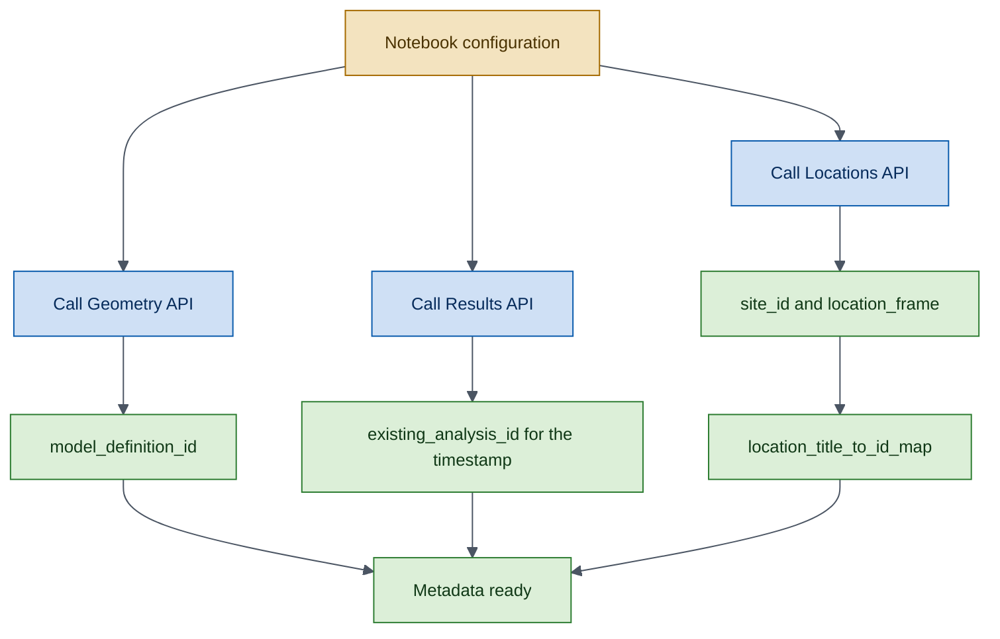
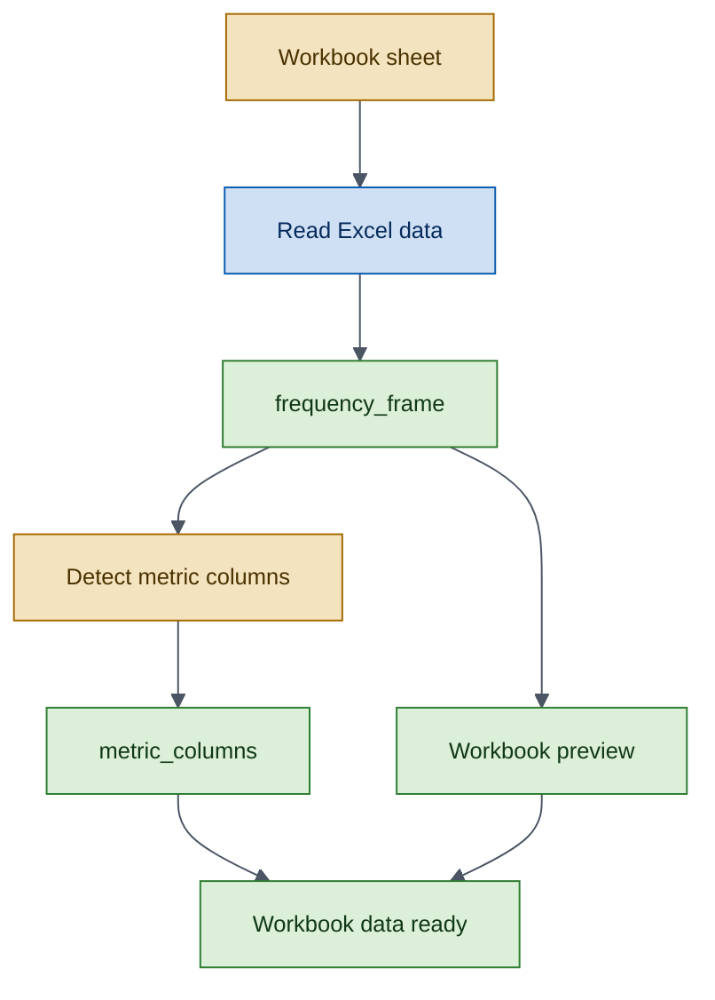
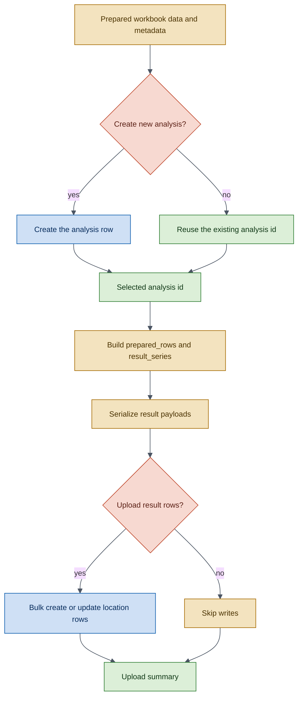
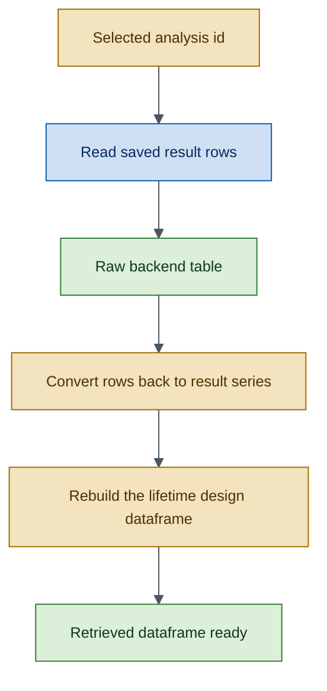
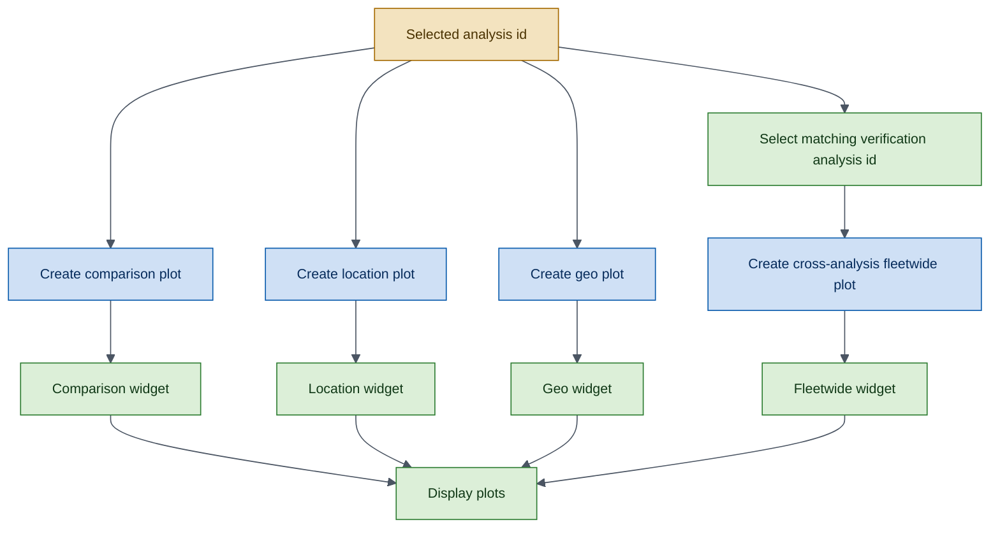

# Lifetime Design Frequencies Workflow

!!! example
    This tutorial walks through the complete `LifetimeDesignFrequencies` lifecycle:
    import workbook data, upload results to the backend, retrieve them, and render
    interactive plots — all as explicit, auditable steps.

## Prerequisites

- Python 3.9+
- `owi-metadatabase-results` and `owi-metadatabase` installed
- A valid API token stored in a `.env` file
- The example workbook at `scripts/data/results-example-data.xlsx`

## Mermaid Color Legend

All workflow diagrams use the same color meaning.

- <span style="color:#0B5CAD;"><strong>Blue</strong></span>: API call.
- <span style="color:#2E7D32;"><strong>Green</strong></span>: data we keep or check.
- <span style="color:#A56A00;"><strong>Yellow</strong></span>: data we build or reshape.
- <span style="color:#C04A2F;"><strong>Red</strong></span>: choice or stop condition.
- <span style="color:#4B5563;"><strong>Grey line</strong></span>: step-to-step flow.

*Read each diagram from top to bottom.*

---

## Step 1 — Import the SDK Components

```python
import datetime
from pathlib import Path

import pandas as pd
from IPython.display import display
from owi.metadatabase.geometry.io import GeometryAPI
from owi.metadatabase.locations.io import LocationsAPI

from owi.metadatabase.results import LifetimeDesignFrequencies, ResultsAPI
from owi.metadatabase.results.models import AnalysisDefinition
from owi.metadatabase.results.serializers import (
    DjangoAnalysisSerializer,
    DjangoResultSerializer,
)
from owi.metadatabase.results.services import ApiResultsRepository, ResultsService
from owi.metadatabase.results.utils import load_token_from_env_file
```

---

## Step 2 — Configure Runtime Constants

```python
WORKSPACE_ROOT = Path.cwd().resolve().parent
WORKBOOK = WORKSPACE_ROOT / "scripts" / "data" / "results-example-data.xlsx"
ENV_FILE = WORKSPACE_ROOT / ".env"
TOKEN_ENV_VAR = "OWI_METADATABASE_API_TOKEN"
BASE_URL = "https://owimetadatabase-dev.azurewebsites.net/api/v1"

PROJECTSITE = "Belwind"
MODEL_DEFINITION = f"as-designed {PROJECTSITE}"
TOKEN = load_token_from_env_file(ENV_FILE, TOKEN_ENV_VAR)
ANALYSIS_TIMESTAMP = datetime.datetime(2026, 3, 31, 12, 0, 0)

# Runtime controls.
CREATE_NEW_ANALYSIS = True
UPLOAD_RESULTS = True
```

---

## Step 3 — Resolve Project and Location Metadata

Before reading the workbook, resolve the backend ids for the target
project site, model definition, asset locations, and any existing
analysis for the chosen timestamp.



```python
locations_api = LocationsAPI(api_root=BASE_URL, token=TOKEN)
geometry_api = GeometryAPI(api_root=BASE_URL, token=TOKEN)
results_api = ResultsAPI(api_root=BASE_URL, token=TOKEN)
analysis = LifetimeDesignFrequencies()
analysis_serializer = DjangoAnalysisSerializer()
result_serializer = DjangoResultSerializer()
results_service = ResultsService(
    repository=ApiResultsRepository(api=results_api)
)

# -- site_id
site_id = locations_api.get_projectsite_detail(
    projectsite=PROJECTSITE
)["id"]

# -- model_definition_id
model_definition_id = geometry_api.get_modeldefinition_id(
    projectsite=PROJECTSITE,
    model_definition=MODEL_DEFINITION,
)["id"]

# -- location_title_to_id_map
assetlocations = locations_api.get_assetlocations(
    projectsite=PROJECTSITE
)["data"]
location_frame = assetlocations.loc[
    :,
    [c for c in ["id", "title", "northing", "easting"]
     if c in assetlocations.columns],
].copy()
location_title_to_id_map = {
    str(row["title"]): int(row["id"])
    for row in location_frame.to_dict(orient="records")
    if row.get("title") is not None and row.get("id") is not None
}

# -- existing_analysis_id
existing_analysis = results_api.get_analysis(
    name=analysis.analysis_name,
    model_definition__id=model_definition_id,
    timestamp=ANALYSIS_TIMESTAMP,
    location__id=None,
)
existing_analysis_id = (
    None
    if not existing_analysis["exists"] or existing_analysis["id"] is None
    else int(existing_analysis["id"])
)
```

---

## Step 4 — Load and Inspect the Workbook Data

Read the Excel sheet and identify the frequency columns (those ending
with `[Hz]`) that will feed the analysis workflow.



```python
sheet_name = "Lifetime -  Design frequencies"
frequency_frame = pd.read_excel(WORKBOOK, sheet_name=sheet_name)

# Detect columns like "FA1 [Hz]", "SS1 [Hz]" and strip the unit suffix.
metric_columns = {
    str(col).replace(" [Hz]", ""): col
    for col in frequency_frame.columns
    if isinstance(col, str) and col.endswith(" [Hz]")
}
```

---

## Step 5 — Build and Upload the Shared Analysis

Build the shared analysis payload, prepare the workbook rows as typed
result series, serialize the payloads, and persist them through
`ResultsAPI`.

When `CREATE_NEW_ANALYSIS` is `True`, a new analysis row is created.
When `False`, the existing timestamped analysis is reused. The same
applies for `UPLOAD_RESULTS` and the result rows.



```python
# -- Analysis definition
analysis_definition = AnalysisDefinition(
    name=analysis.analysis_name,
    model_definition_id=model_definition_id,
    location_id=None,
    source_type="json",
    source=str(WORKBOOK),
    timestamp=ANALYSIS_TIMESTAMP,
    description="Shared lifetime design frequencies upload.",
    additional_data={
        "input_file": WORKBOOK.name,
        "sheet_name": sheet_name,
    },
)
analysis_payload = analysis_serializer.to_payload(analysis_definition)

# -- Create or reuse the analysis
if CREATE_NEW_ANALYSIS:
    created_analysis = results_api.create_analysis(analysis_payload)
    analysis_id = int(created_analysis["id"])
else:
    analysis_id = existing_analysis_id

# -- Prepare rows and convert to typed ResultSeries
prepared_rows = [
    {
        "turbine": str(row["Turbine"]),
        "reference": str(row["Reference"]),
        "site_id": site_id,
        "location_id": location_title_to_id_map.get(str(row["Turbine"])),
        **{
            metric: row.get(source_column)
            for metric, source_column in metric_columns.items()
        },
    }
    for row in frequency_frame.to_dict(orient="records")
]
result_series = analysis.to_results({"rows": prepared_rows})

# -- Serialize and upload
results_payloads = [
    result_serializer.to_payload(series, analysis_id=analysis_id)
    for series in result_series
]
if UPLOAD_RESULTS:
    upload_result = results_api.create_or_update_results_bulk(
        results_payloads
    )
```

---

## Step 6 — Retrieve and Reconstruct

Read the persisted result rows back from the API and reconstruct the
normalized analysis frame.



```python
raw_results_frame = results_api.list_results(
    analysis=analysis_id
)["data"]
retrieved_series = [
    result_serializer.from_mapping(row)
    for row in raw_results_frame.to_dict(orient="records")
]
retrieved_frame = analysis.from_results(retrieved_series)
print(retrieved_frame.head())
```

---

## Step 7 — Plot the Results

The `ResultsService` provides four plot types relevant to this workflow:

| Plot type | Visualization |
|-----------|---------------|
| `comparison` | Metrics across references with a location dropdown. |
| `location` | Values grouped by turbine with a metric dropdown. |
| `geo` | Results projected onto a geographic site map. |
| `cross_analysis_fleetwide` | Fleetwide overlay combining persisted frequency and verification analyses. |

The cross-analysis fleetwide plot assumes you already have a matching
`LifetimeDesignVerification` analysis persisted for the same assets.



```python
filters = {"analysis_id": analysis_id}

comparison_plot = results_service.plot_results(
    analysis.analysis_name,
    filters=filters,
    plot_type="comparison",
)

location_plot = results_service.plot_results(
    analysis.analysis_name,
    filters=filters,
    plot_type="location",
)

geo_plot = results_service.plot_results(
    analysis.analysis_name,
    filters=filters,
    plot_type="geo",
)

frequency_analysis_id = analysis_id
verification_analysis_id = 52  # Existing LifetimeDesignVerification analysis for the same assets

cross_analysis_fleetwide_plot = results_service.plot_results(
    plot_type="cross_analysis_fleetwide",
    source_filters={
        "frequency": {"analysis_id": frequency_analysis_id},
        "verification": {"analysis_id": verification_analysis_id},
    },
)

# Display in a notebook environment.
display(comparison_plot.notebook)
display(location_plot.notebook)
display(geo_plot.notebook)
display(cross_analysis_fleetwide_plot.notebook)
```

---

## What You Learned

- How to resolve project metadata through `LocationsAPI` and `GeometryAPI`.
- How to prepare workbook data and serialize it into backend-compatible
  payloads using `AnalysisDefinition` and `DjangoResultSerializer`.
- How to conditionally create or reuse analyses and upload result rows
  with `create_or_update_results_bulk`.
- How to retrieve and reconstruct typed result series from persisted data.
- How to render comparison, location, geo, and cross-analysis fleetwide plots through
  `ResultsService`.

## Next Steps

- [Lifetime Design Verification Workflow](lifetime-design-verification.md) —
  the same upload-retrieve-plot cycle for design verification data.
- [Reference: Analysis Queries](../reference/query-examples/analyses.md) —
  Django ORM examples for the `Analysis` model.
- [Explanation: Architecture](../explanation/architecture.md) —
  understand the design patterns behind the SDK.
