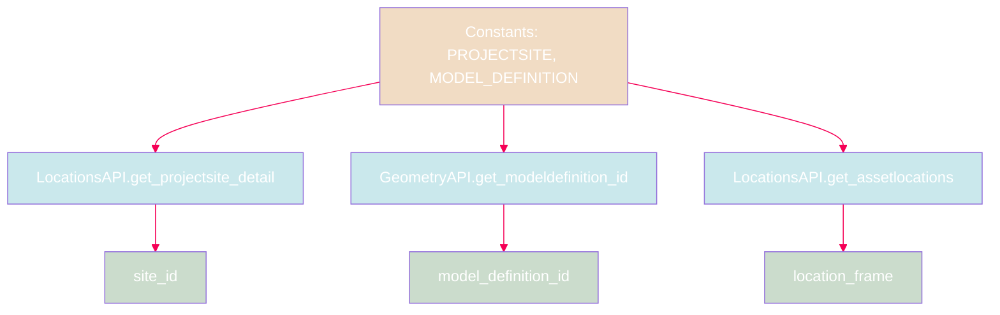
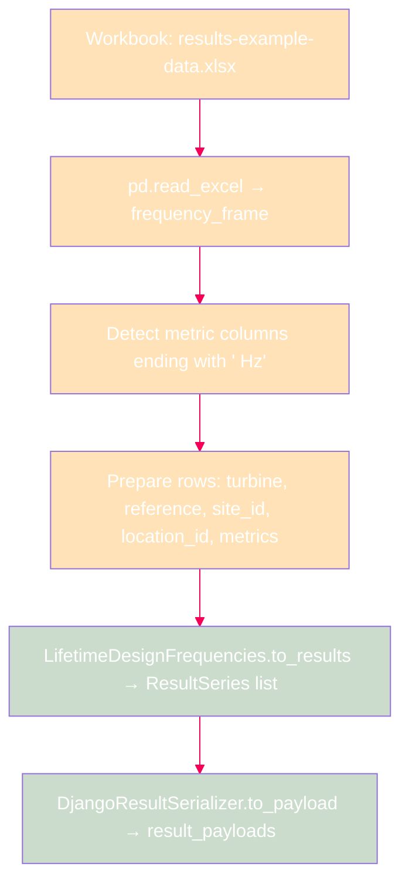
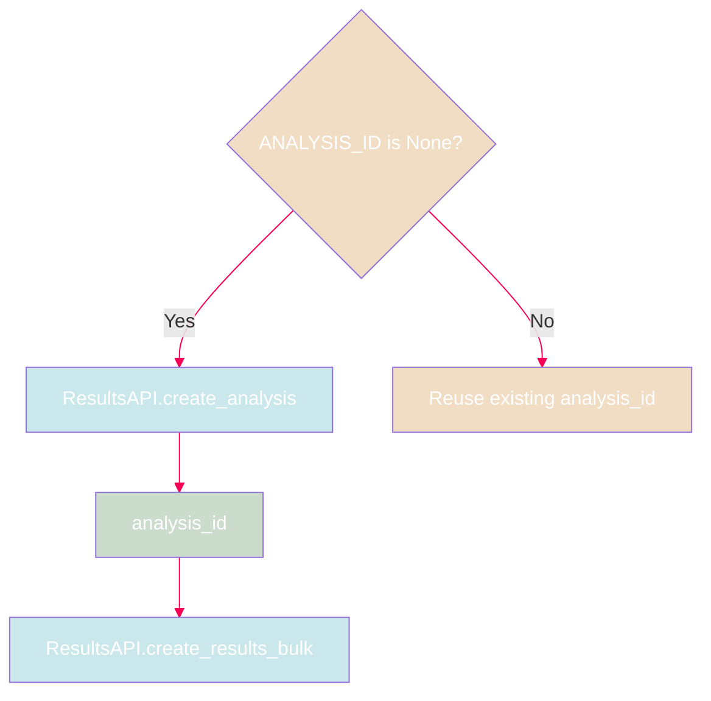
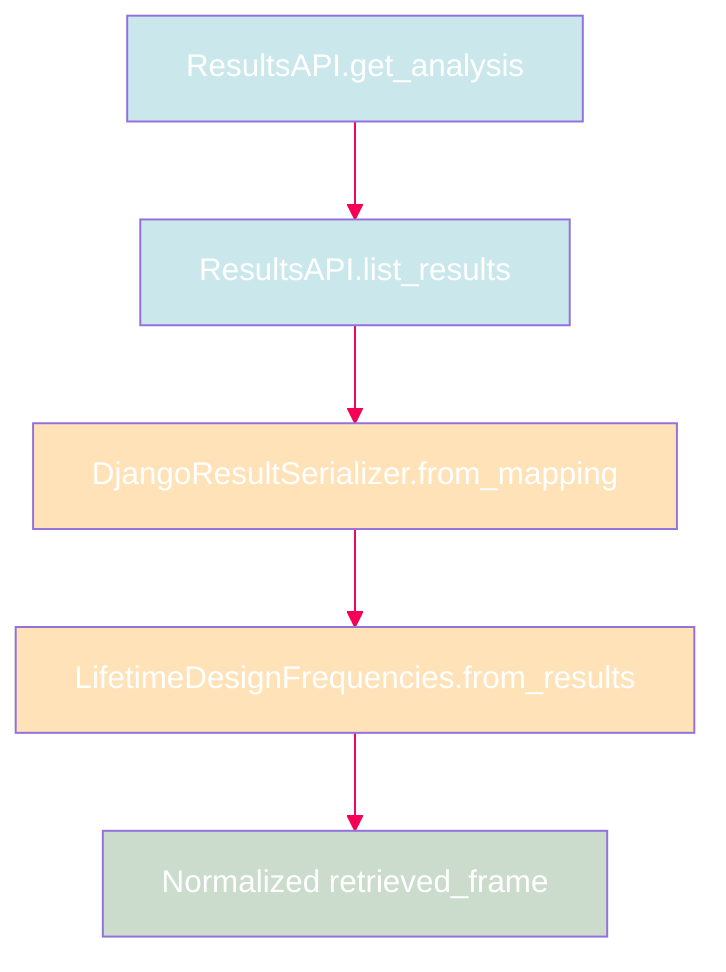
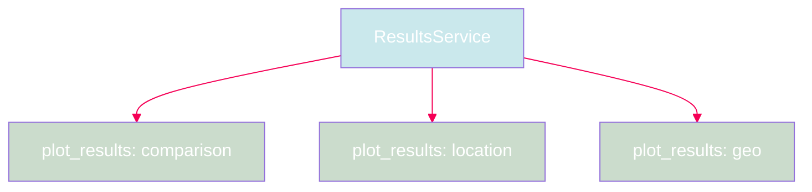

# Lifetime Design Frequencies Workflow

This tutorial walks through the complete `LifetimeDesignFrequencies` lifecycle:
import workbook data, upload results to the backend, retrieve them, and render
interactive plots — all as explicit, auditable steps.

## Prerequisites

- Python 3.11+
- `owi-metadatabase-results` and `owi-metadatabase` installed
- A valid API token stored in a `.env` file
- The example workbook at `scripts/data/results-example-data.xlsx`

## Mermaid Color Legend

The diagrams in this tutorial use a consistent visual language:

- <span style="color:#a1d7dd">**Blue nodes**</span>: API calls, services, or external system interactions.
- <span style="color:#a3c2a5">**Green nodes**</span>: Validated outputs, identifiers, or reconstructed frames.
- <span style="color:#ffcc80">**Amber nodes**</span>: Transformation, serialization, or intermediate steps.
- <span style="color:#e7c197">**Orange nodes**</span>: Branching logic, runtime choices, or request definitions.

---

## Step 1 — Import the SDK Components

```python
import datetime
from pathlib import Path

import pandas as pd
from IPython.display import display
from owi.metadatabase.geometry.io import GeometryAPI
from owi.metadatabase.locations.io import LocationsAPI

from owi.metadatabase.results import (
    LifetimeDesignFrequencies,
    ResultsAPI,
    ResultsService,
)
from owi.metadatabase.results.models import AnalysisDefinition
from owi.metadatabase.results.serializers import (
    DjangoAnalysisSerializer,
    DjangoResultSerializer,
)
from owi.metadatabase.results.services import ApiResultsRepository
from owi.metadatabase.results.utils import load_token_from_env_file
```

---

## Step 2 — Configure Runtime Constants

```python
WORKSPACE_ROOT = Path.cwd().resolve().parent
WORKBOOK = WORKSPACE_ROOT / "scripts" / "data" / "results-example-data.xlsx"
ENV_FILE = WORKSPACE_ROOT / ".env"
TOKEN_ENV_VAR = "OWI_METADATABASE_API_TOKEN"
BASE_URL = "https://owimetadatabase-dev.azurewebsites.net/api/v1"

PROJECTSITE = "Belwind"
MODEL_DEFINITION = f"as-designed {PROJECTSITE}"
TOKEN = load_token_from_env_file(ENV_FILE, TOKEN_ENV_VAR)

# Set to an existing analysis id to skip the upload step.
ANALYSIS_ID: int | None = None
```

---

## Step 3 — Resolve Project and Location Metadata

Before uploading results, resolve the backend identifiers for the target
project site, model definition, and asset locations.



```python
locations_api = LocationsAPI(api_root=BASE_URL, token=TOKEN)
geometry_api = GeometryAPI(api_root=BASE_URL, token=TOKEN)

site_id = locations_api.get_projectsite_detail(
    projectsite=PROJECTSITE
)["id"]

model_definition_id = geometry_api.get_modeldefinition_id(
    projectsite=PROJECTSITE,
    model_definition=MODEL_DEFINITION,
)["id"]

assetlocations = locations_api.get_assetlocations(
    projectsite=PROJECTSITE
)["data"]

# Build a title → id mapping for resolving turbine names.
location_frame = assetlocations.loc[
    :,
    [c for c in ["id", "title", "northing", "easting"]
     if c in assetlocations.columns],
].copy()

location_title_to_id_map = {
    str(row["title"]): int(row["id"])
    for row in location_frame.to_dict(orient="records")
    if row.get("title") is not None and row.get("id") is not None
}
```

---

## Step 4 — Prepare Workbook Data and Serialize

Read the Excel sheet, detect frequency metric columns, and convert each
row into a validated `ResultSeries` payload ready for the backend.



```python
analysis = LifetimeDesignFrequencies()
analysis_serializer = DjangoAnalysisSerializer()
result_serializer = DjangoResultSerializer()

sheet_name = "Lifetime -  Design frequencies"
frequency_frame = pd.read_excel(WORKBOOK, sheet_name=sheet_name)

# Detect columns like "FA1 [Hz]", "SS1 [Hz]" and strip the unit suffix.
metric_columns = {
    str(col).replace(" [Hz]", ""): col
    for col in frequency_frame.columns
    if isinstance(col, str) and col.endswith(" [Hz]")
}

# Build the analysis definition payload.
analysis_definition = AnalysisDefinition(
    name=analysis.analysis_name,
    model_definition_id=model_definition_id,
    location_id=None,
    source_type="notebook",
    source=str(WORKBOOK),
    description="Workbook upload for the lifetime design frequencies sheet.",
    additional_data={"sheet_name": sheet_name},
)
analysis_payload = analysis_serializer.to_payload(analysis_definition)

# Prepare rows for validation and serialization.
prepared_rows = [
    {
        "turbine": str(row["Turbine"]),
        "reference": str(row["Reference"]),
        "site_id": site_id,
        "location_id": location_title_to_id_map.get(str(row["Turbine"])),
        **{
            metric: row.get(source_column)
            for metric, source_column in metric_columns.items()
        },
    }
    for row in frequency_frame.to_dict(orient="records")
]

# Validate and convert to typed ResultSeries objects.
result_series = analysis.to_results({"rows": prepared_rows})
result_payloads = [
    result_serializer.to_payload(item, analysis_id=0)
    for item in result_series
]
```

---

## Step 5 — Upload to the Backend

Upload only runs when `ANALYSIS_ID` is `None`. When reusing an existing
analysis, set `ANALYSIS_ID` to skip straight to retrieval.



```python
api = ResultsAPI(api_root=BASE_URL, token=TOKEN)
analysis_id = ANALYSIS_ID

if analysis_id is None:
    # Filter out rows without a resolved location.
    upload_payloads = [
        p for p in result_payloads if p.get("location") is not None
    ]

    # Create the analysis row.
    created_analysis = api.create_analysis(analysis_payload)
    analysis_id = int(created_analysis["id"])

    # Bulk-upload all result payloads with the real analysis id.
    api.create_results_bulk(
        [{**p, "analysis": analysis_id} for p in upload_payloads]
    )
```

---

## Step 6 — Retrieve and Reconstruct

Read the persisted analysis and result rows back from the API and
reconstruct the normalized analysis frame.



```python
retrieved_analysis = api.get_analysis(
    model_definition=MODEL_DEFINITION,
    name=analysis.analysis_name,
    timestamp__gte=(
        datetime.datetime.now(datetime.timezone.utc)
        - datetime.timedelta(days=365)
    ),
)

raw_results_frame = api.list_results(
    analysis=retrieved_analysis["data"].id
)["data"]

# Deserialize and reconstruct.
retrieved_series = [
    result_serializer.from_mapping(row)
    for row in raw_results_frame.to_dict(orient="records")
]
retrieved_frame = analysis.from_results(retrieved_series)
print(retrieved_frame.head())
```

---

## Step 7 — Plot the Results

The `ResultsService` provides three plot types for this analysis:

| Plot type | Visualization |
|-----------|---------------|
| `comparison` | Metrics across references with a location dropdown. |
| `location` | Values grouped by turbine with a metric dropdown. |
| `geo` | Results projected onto a geographic site map. |



```python
results_service = ResultsService(
    repository=ApiResultsRepository(api=api)
)
filters = {"analysis_id": retrieved_analysis["data"].id[0]}

comparison_plot = results_service.plot_results(
    analysis.analysis_name,
    filters=filters,
    plot_type="comparison",
)

location_plot = results_service.plot_results(
    analysis.analysis_name,
    filters=filters,
    plot_type="location",
)

geo_plot = results_service.plot_results(
    analysis.analysis_name,
    filters=filters,
    plot_type="geo",
)

# Display in a notebook environment.
display(comparison_plot.notebook)
display(location_plot.notebook)
display(geo_plot.notebook)
```

---

## What You Learned

- How to resolve project metadata through `LocationsAPI` and `GeometryAPI`.
- How to prepare workbook data and serialize it into backend-compatible
  payloads using `AnalysisDefinition` and `DjangoResultSerializer`.
- How to conditionally upload analyses and results to the backend.
- How to retrieve and reconstruct typed result series from persisted data.
- How to render comparison, location, and geo plots through
  `ResultsService`.

## Next Steps

- [Reference: Analysis Queries](../reference/query-examples/analyses.md) —
  Django ORM examples for the `Analysis` model.
- [Reference: Result Queries](../reference/query-examples/results.md) —
  Django ORM examples for the `Result` model.
- [Explanation: Architecture](../explanation/architecture.md) —
  understand the design patterns behind the SDK.
