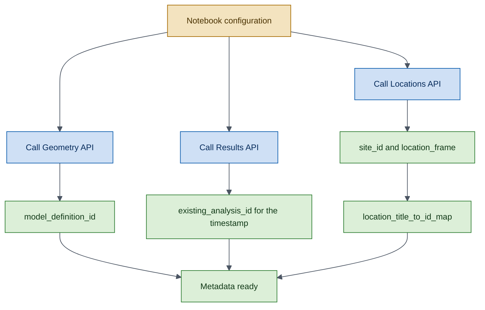
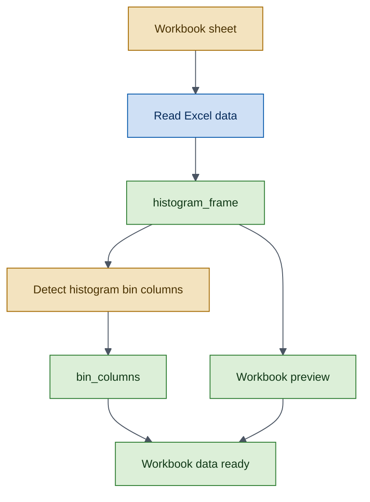
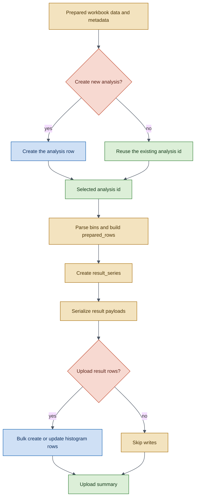
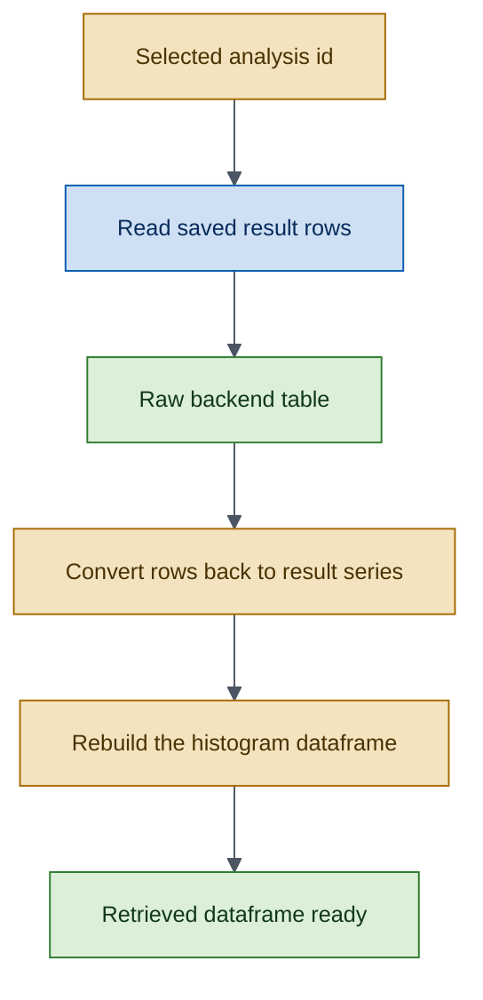
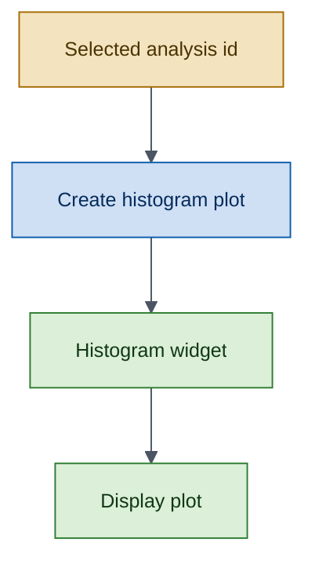

# Wind Speed Histogram Workflow

!!! example
    This tutorial walks through the complete `WindSpeedHistogram` lifecycle:
    load histogram data from a workbook, upload results to the backend,
    retrieve them, and render an interactive histogram plot — all as explicit,
auditable steps.

## Prerequisites

- Python 3.9+
- `owi-metadatabase-results` and `owi-metadatabase` installed
- A valid API token stored in a `.env` file
- The example workbook at `scripts/data/results-example-data.xlsx`

## Mermaid Color Legend

All workflow diagrams use the same color meaning.

- <span style="color:#0B5CAD;"><strong>Blue</strong></span>: API call.
- <span style="color:#2E7D32;"><strong>Green</strong></span>: data we keep or check.
- <span style="color:#A56A00;"><strong>Yellow</strong></span>: data we build or reshape.
- <span style="color:#C04A2F;"><strong>Red</strong></span>: choice or stop condition.
- <span style="color:#4B5563;"><strong>Grey line</strong></span>: step-to-step flow.

*Read each diagram from top to bottom.*

---

## Step 1 — Import the SDK Components

```python
import datetime
from pathlib import Path

import pandas as pd
from owi.metadatabase.geometry.io import GeometryAPI
from owi.metadatabase.locations.io import LocationsAPI

from owi.metadatabase.results import ResultsAPI, WindSpeedHistogram
from owi.metadatabase.results.models import AnalysisDefinition
from owi.metadatabase.results.serializers import (
    DjangoAnalysisSerializer,
    DjangoResultSerializer,
)
from owi.metadatabase.results.services import ApiResultsRepository, ResultsService
from owi.metadatabase.results.utils import load_token_from_env_file
```

---

## Step 2 — Configure Runtime Constants

```python
WORKSPACE_ROOT = Path.cwd().resolve().parent
WORKBOOK = WORKSPACE_ROOT / "scripts" / "data" / "results-example-data.xlsx"
ENV_FILE = WORKSPACE_ROOT / ".env"
TOKEN_ENV_VAR = "OWI_METADATABASE_API_TOKEN"
BASE_URL = "https://owimetadatabase-dev.azurewebsites.net/api/v1"

PROJECTSITE = "Belwind"
MODEL_DEFINITION = f"as-designed {PROJECTSITE}"
TOKEN = load_token_from_env_file(ENV_FILE, TOKEN_ENV_VAR)
ANALYSIS_TIMESTAMP = datetime.datetime(2026, 3, 31, 12, 0, 0)

# Runtime controls.
CREATE_NEW_ANALYSIS = True
UPLOAD_RESULTS = True
```

---

## Step 3 — Resolve Project and Location Metadata

Before reading the workbook, resolve the backend identifiers for the
target project site, model definition, and asset locations.



```python
locations_api = LocationsAPI(api_root=BASE_URL, token=TOKEN)
geometry_api = GeometryAPI(api_root=BASE_URL, token=TOKEN)
results_api = ResultsAPI(api_root=BASE_URL, token=TOKEN)
analysis = WindSpeedHistogram()
analysis_serializer = DjangoAnalysisSerializer()
result_serializer = DjangoResultSerializer()
results_service = ResultsService(
    repository=ApiResultsRepository(api=results_api)
)

# -- site_id
site_id = locations_api.get_projectsite_detail(
    projectsite=PROJECTSITE
)["id"]

# -- model_definition_id
model_definition_id = geometry_api.get_modeldefinition_id(
    projectsite=PROJECTSITE,
    model_definition=MODEL_DEFINITION,
)["id"]

# -- location_title_to_id_map
assetlocations = locations_api.get_assetlocations(
    projectsite=PROJECTSITE
)["data"]
location_frame = assetlocations.loc[
    :,
    [c for c in ["id", "title", "northing", "easting"]
     if c in assetlocations.columns],
].copy()
location_title_to_id_map = {
    str(row["title"]): int(row["id"])
    for row in location_frame.to_dict(orient="records")
    if row.get("title") is not None and row.get("id") is not None
}

# -- existing_analysis_id
existing_analysis = results_api.get_analysis(
    name=analysis.analysis_name,
    model_definition__id=model_definition_id,
    timestamp=ANALYSIS_TIMESTAMP,
    location__id=None,
)
existing_analysis_id = (
    None
    if not existing_analysis["exists"] or existing_analysis["id"] is None
    else int(existing_analysis["id"])
)
```

---

## Step 4 — Load and Inspect the Workbook Data

Read the Excel sheet and identify the histogram bin columns (those
starting with `[`) that define the wind speed bins.



```python
import re

def _parse_bin_edges(label: str) -> tuple[float, float]:
    """Extract left and right edges from a bin label like '[0,1['."""
    numbers = [
        float(v) for v in re.findall(r"-?\d+(?:\.\d+)?", label)
    ]
    if len(numbers) < 2:
        raise ValueError(
            f"Could not parse histogram bin edges from {label!r}."
        )
    return numbers[0], numbers[1]

sheet_name = "Lifetime - Wind Histogram"
histogram_frame = pd.read_excel(
    WORKBOOK, sheet_name=sheet_name, header=1
)
bin_columns = [
    col for col in histogram_frame.columns
    if isinstance(col, str) and col.startswith("[")
]
```

---

## Step 5 — Build and Upload the Shared Analysis

Build the shared analysis payload, prepare each workbook row as a typed
histogram result series with parsed bin edges, serialize the payloads,
and persist them through `ResultsAPI`.

When `CREATE_NEW_ANALYSIS` is `True`, a new analysis row is created.
When `False`, the existing timestamped analysis is reused. The same
applies for `UPLOAD_RESULTS` and the result rows.



```python
# -- Analysis definition
analysis_definition = AnalysisDefinition(
    name=analysis.analysis_name,
    model_definition_id=model_definition_id,
    location_id=None,
    source_type="json",
    source=str(WORKBOOK),
    timestamp=ANALYSIS_TIMESTAMP,
    description="Shared wind speed histogram upload.",
    additional_data={
        "input_file": WORKBOOK.name,
        "sheet_name": sheet_name,
    },
)
analysis_payload = analysis_serializer.to_payload(analysis_definition)

# -- Create or reuse the analysis
if CREATE_NEW_ANALYSIS:
    created_analysis = results_api.create_analysis(analysis_payload)
    analysis_id = int(created_analysis["id"])
else:
    analysis_id = existing_analysis_id

# -- Prepare rows with parsed bin edges and scope-dependent location ids
prepared_rows = [
    {
        "title": str(row["Title"]),
        "description": row.get("Description"),
        "scope_label": str(row["Scope"]).strip(),
        "site_id": site_id,
        "location_id": (
            None
            if str(row["Scope"]).strip() == "Site"
            else location_title_to_id_map.get(
                str(row["Scope"]).strip()
            )
        ),
        "bins": [_parse_bin_edges(str(col)) for col in bin_columns],
        "values": [float(row[col]) for col in bin_columns],
        "metadata": {"sheet_scope": str(row["Scope"]).strip()},
    }
    for row in histogram_frame.to_dict(orient="records")
]
result_series = analysis.to_results({"series": prepared_rows})

# -- Serialize and upload
results_payloads = [
    result_serializer.to_payload(series, analysis_id=analysis_id)
    for series in result_series
]
if UPLOAD_RESULTS:
    upload_result = results_api.create_or_update_results_bulk(
        results_payloads
    )
```

---

## Step 6 — Retrieve and Reconstruct

Read the persisted result rows back from the API and reconstruct the
normalized histogram dataframe.



```python
raw_results_frame = results_api.list_results(
    analysis=analysis_id
)["data"]
retrieved_series = [
    result_serializer.from_mapping(row)
    for row in raw_results_frame.to_dict(orient="records")
]
retrieved_frame = analysis.from_results(retrieved_series)
print(retrieved_frame.head())
```

---

## Step 7 — Plot the Results

The `ResultsService` provides a histogram plot type for this analysis.

| Plot type | Visualization |
|-----------|---------------|
| `histogram` | Bin distribution for each series, with site or turbine scope. |



```python
filters = {"analysis_id": analysis_id}

histogram_plot = results_service.plot_results(
    analysis.analysis_name,
    filters=filters,
    plot_type="histogram",
)

# Display in a notebook environment.
display(histogram_plot.notebook)
```

---

## What You Learned

- How to resolve project metadata through `LocationsAPI` and `GeometryAPI`.
- How to parse histogram bin labels into numeric edge pairs.
- How to prepare histogram data with scope-dependent location ids and
  serialize it into backend-compatible payloads.
- How to conditionally create or reuse analyses and upload result rows
  with `create_or_update_results_bulk`.
- How to retrieve and reconstruct typed histogram series from persisted data.
- How to render histogram plots through `ResultsService`.

## Next Steps

- [Lifetime Design Frequencies Workflow](lifetime-design-frequencies.md) —
  the upload-retrieve-plot cycle for design frequency data.
- [Lifetime Design Verification Workflow](lifetime-design-verification.md) —
  the same cycle for design verification data.
- [Reference: Analysis Queries](../reference/query-examples/analyses.md) —
  Django ORM examples for the `Analysis` model.
